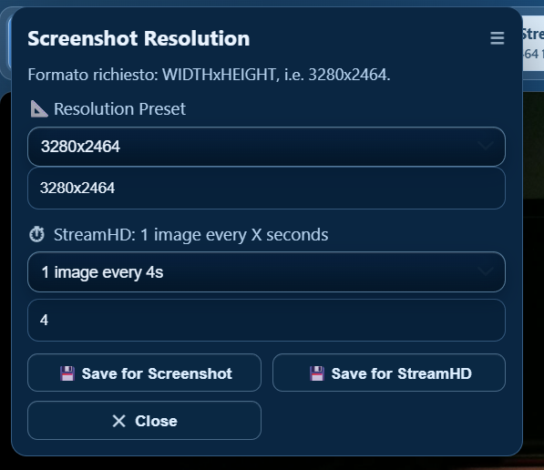
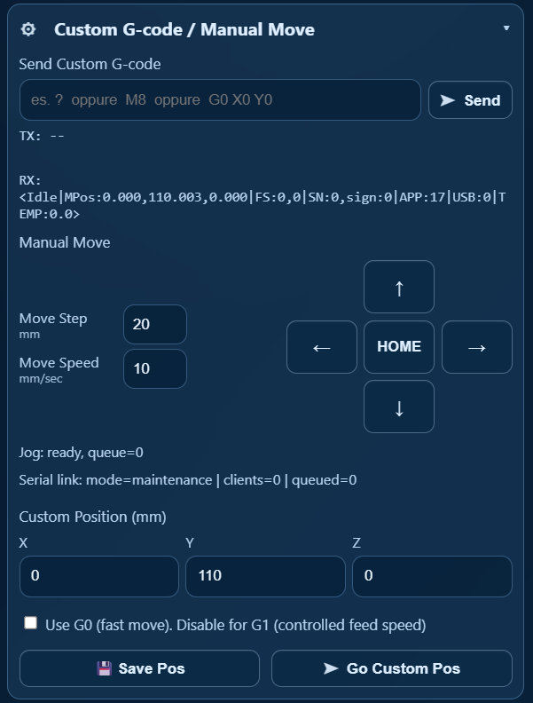
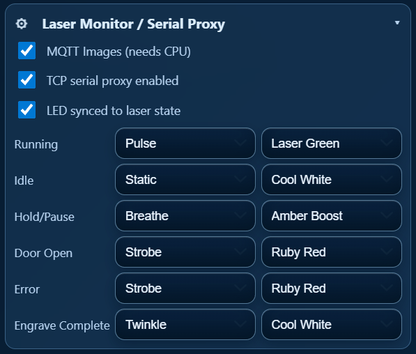
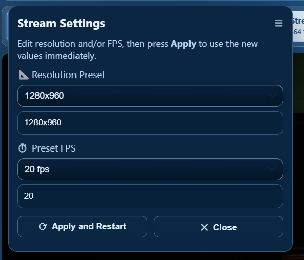

# 🛰️ LaserAirCam
**Smart Raspberry Pi companion for laser engravers**  
*Wi-Fi Camera • Serial Gateway • AirAssist Control • Visual Status Feedback*

> LaserAirCam is an all-in-one control node designed to make your laser setup cleaner, safer, and synchronized. It combines HD streaming, robust wireless serial, and automated hardware feedback.

---

### 🛠️ Key Features

| 📷 Vision & UI | 🔌 Connectivity & Control | 💨 Automation & Body |
| :--- | :--- | :--- |
| 🖼️ **Smart Stream:** Live MJPEG (`/stream`), snapshots (`/snapshot`), and **StreamHD** (`/streamhd`) for timed high-res captures. | 📶 **Stable Wi-Fi Link:** Transparent serial via `ser2net` & Virtual COM. Monitors GRBL traffic end-to-end for total stability. | 🌬️ **AirAssist:** 24V PWM control. Automatic mode (laser-power based) with manual override via UI or Home Assistant. |
| 💻 **WebUI & API:** Full browser dashboard for laser status, LEDs, and system. Fast API endpoints for custom automation. | 🔁 **Serial Gateway:** Intercepts traffic; if LightBurn is active, manual commands are safely queued and sent when possible. | 🌈 **RGB Status:** Addressable LED profiles: `idle`, `running`, `engraving`, `hold/pause`, `error`, and `door` alerts. |
| 🏠 **MQTT + HA:** Native bridge with auto-discovery. Exposes camera, status, and control entities for smart workflows. | 📡 **Remote Ready:** Designed for reliable long-range control, eliminating unstable and messy USB cable runs. | 📦 **Hardware:** 3x physical buttons for local interaction + custom 3D-printed case for Atomstack A1 & similar. |

---

### 🏁 Quick Start
1. Flash your Raspberry Pi and follow the detailed guide in [**setup.md**](./setup.md).
2. Configure your Virtual COM port on PC and point LightBurn to the device IP.
3. Enjoy a wireless, automated, and visually interactive laser engraving experience.

**🖥️ Hardware Requirements:** [See hwreq.md](./hwreq.md)

[**📚 Full Setup Guide**](./setup.md) | [**🐞 Report Issue**](../../issues) | [**💡 Suggest Feature**](../../discussions)

---

## 🖼️ Preview

<table>
	<tr>
		<td align="center">
			 
			<b>Capture</b> 
			Camera capture snapshot and streamHD.
		</td>
		<td align="center">
			 
			<b>Custom GCode</b> 
			Interface for sending custom GCode commands or manual move.
		</td>
	</tr>
	<tr>
		<td align="center">
			 
			<b>Laser Monitor</b> 
			Parameters settings and leds notification.
		</td>
		<td align="center">
			 
			<b>Stream</b> 
			Stream settings.
		</td>
	</tr>
</table>

