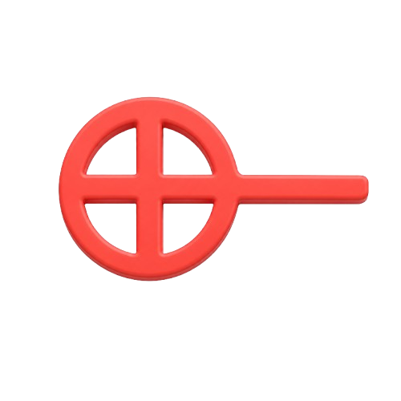
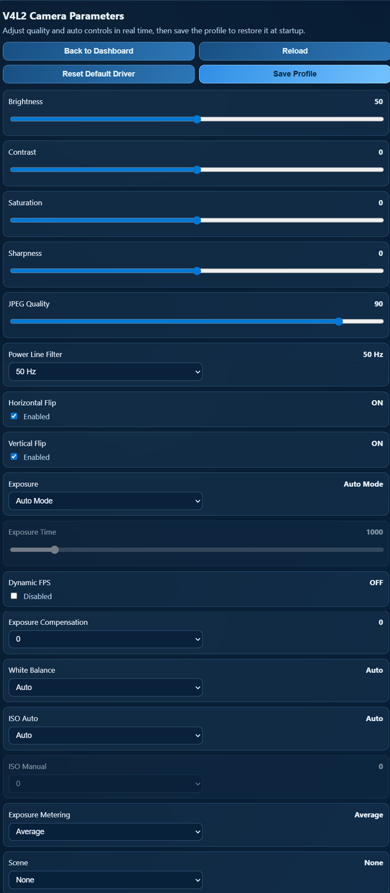
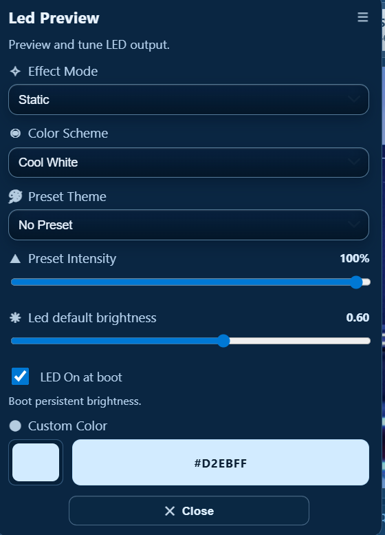
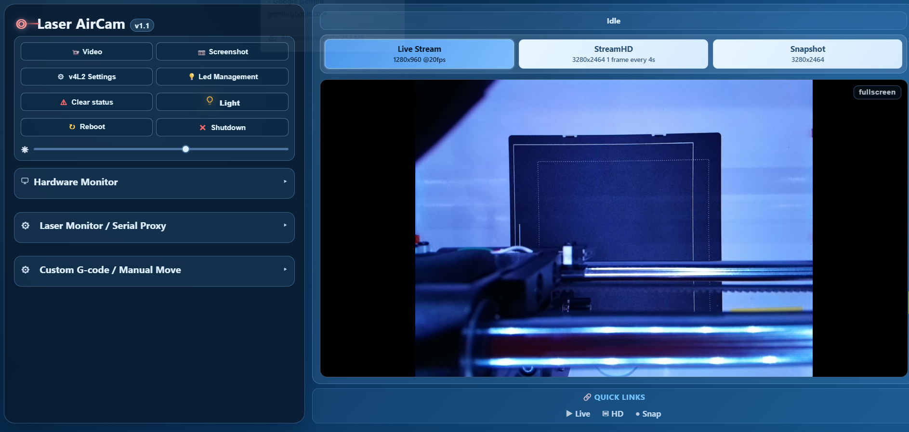
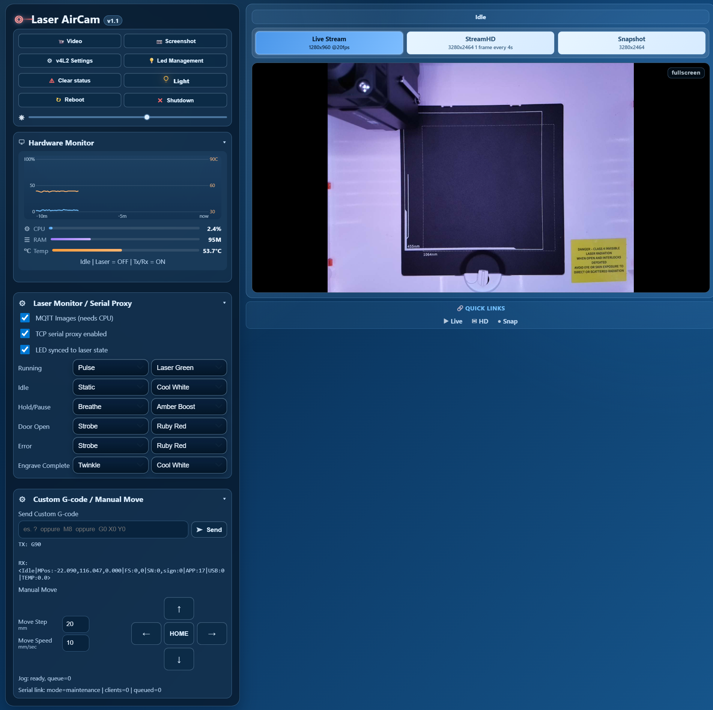
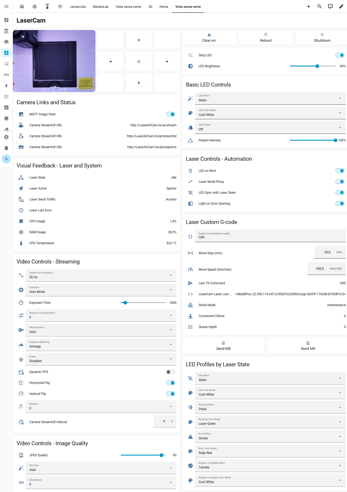

#  LaserAirCam
**Smart Raspberry Pi companion for laser engravers**  
*Wi-Fi Camera • Serial Gateway • AirAssist Control • Visual Status Feedback • HomeAssistant Ready*

> LaserAirCam is an all-in-one control node designed to make your laser setup cleaner, safer, and synchronized. It combines HD streaming, robust wireless serial, and automated hardware feedback.

---

### 🛠️ Key Features

<table>
	<tr>
		<td valign="top" width="50%">
			<ul>
				<li><b>🖼️ Smart Stream:</b> Live MJPEG (<code>/stream</code>), snapshots (<code>/snapshot</code>), and <b>StreamHD</b> (<code>/streamhd</code>) for timed high-res captures.</li>
				<li><b>💻 WebUI & API:</b> Full browser dashboard for laser status, LEDs, and system. Fast API endpoints for custom automation.</li>
				<li><b>🏠 MQTT + Home Assistant:</b> Native bridge with auto-discovery. Exposes camera, status, and control entities for smart workflows.</li>
				<li><b>🌈 RGB Status:</b> Addressable LED profiles: <code>idle</code>, <code>running</code>, <code>engraving</code>, <code>hold/pause</code>, <code>error</code>, and <code>door</code> alerts.</li>
				<li><b>📦 Hardware:</b> 3x physical buttons for local interaction + custom 3D-printed case for Atomstack A1 & similar.</li>
			</ul>
		</td>
		<td valign="top" width="50%">
			<ul>
				<li><b>📶 Stable Wi-Fi Link:</b> Transparent serial via <code>ser2net</code> & Virtual COM. Monitors GRBL traffic end-to-end for total stability.</li>
				<li><b>🔁 Serial Gateway:</b> Intercepts traffic; if LightBurn is active, manual commands are safely queued and sent when possible.</li>
				<li><b>🌬️ AirAssist:</b> 24V PWM control. Automatic mode (laser-power based) with manual override via UI or Home Assistant.</li>
				<li><b>📡 Remote Ready:</b> Designed for reliable long-range control, eliminating unstable and messy USB cable runs.</li>
				<li><b>🆕 Hybrid or Complete Passthrough:</b> Allows you to control the laser even when LightBurn is connected, enabling advanced workflows and manual overrides without disconnecting.</li>
				<li><b>🆕 GCODE Reading for AirAssist:</b> Reads GCODE sent by LightBurn to quickly set AirAssist based on material or cut layer, with automatic on/off and optimized settings for each job.</li>
			</ul>
		</td>
	</tr>
</table>

	<b>🔗 <a href="https://wavelov3r.github.io/LaserAirCam/">Try a Live Demo</a></b>  
	<i>(Demo data currently unavailable)</i>

---

### 🏁 Quick Start
1. Flash your Raspberry Pi with an OS using Raspberry Pi Imager (DietPi advised).
2. Follow the detailed instructions in the [**setup guide**](./docs/setup.md) to configure the Virtual COM port over LAN, camera, Ustreamer, and install all dependencies (LEDs and Python packages) before installing LaserAirCam.
3. On your PC, configure LightBurn to use the virtual COM port over LAN (Initialized by HW Virtual Serial port); point the Camera source to the raspberryPi.
4. Enjoy a wireless, automated, and visually interactive laser engraving experience.

[**| 🖥️ Hardware Requirements:**](./docs/hwreq.md)
[**| 📚 Setup Guide**](./docs/setup.md)
[**| 🐞 Report Issue**](../../issues)
[**| 💡 Suggest Feature**|](../../discussions)

---

## 🖼️ Preview

<table>
	<tr>
		<td align="center">
			 
			<b>Capture</b> 
			Camera capture snapshot and StreamHD.
		</td>
		<td align="center">
			 
			<b>Custom GCode</b> 
			Send custom GCode commands or manual moves.
		</td>
		<td align="center">
			 
			<b>V4L2 Camera</b> 
			Camera device and V4L2 controls settings.
		</td>
	</tr>
	<tr>
		<td align="center">
			 
			<b>Laser Monitor</b> 
			Laser parameters and LED notifications.
		</td>
		<td align="center">
			 
			<b>LED Management</b> 
			LED color and effect controls.
		</td>
		<td align="center">
			 
			<b>Main Dashboard</b> 
			Main control and status overview.
		</td>
	</tr>
	<tr>
		<td align="center">
			 
			<b>Stream</b> 
			Stream settings and live video.
		</td>
		<td align="center">
			 
			<b>Full Size Screen</b> 
		</td>
		<td align="center">
			 
			<b>Homeassistant Controls</b> 
		</td>
	</tr>
</table>

  💳 Buy me a beer 🍺🍺   

  

