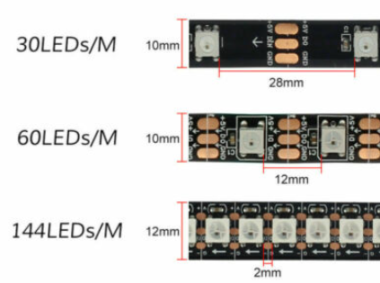
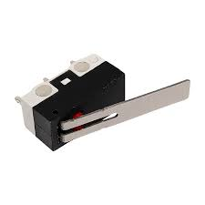
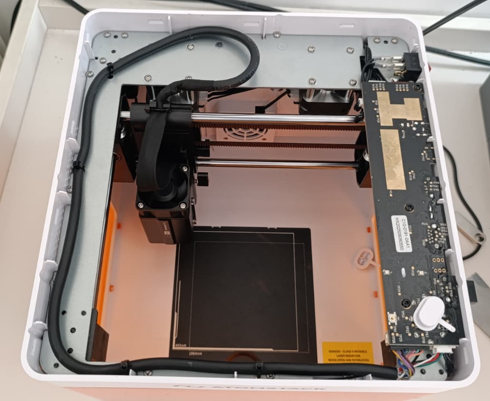
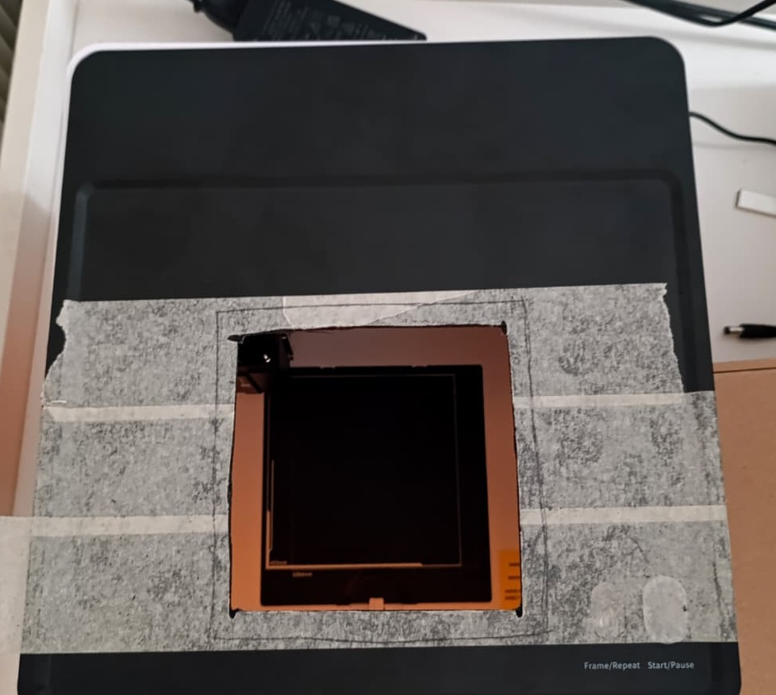
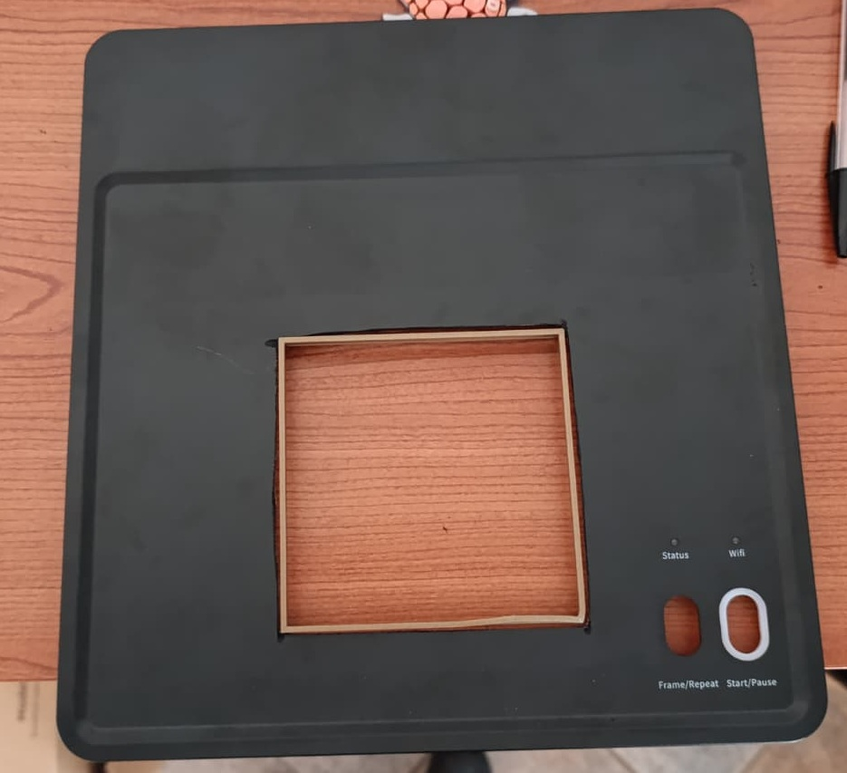
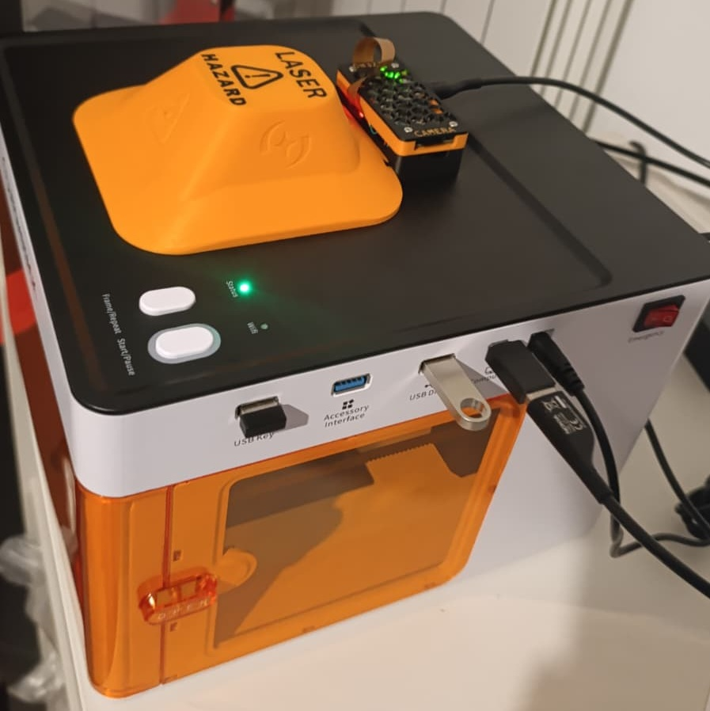

## 🔧 Hardware Requirements

- 🖥️ **Raspberry Pi Zero 2W** (or higher, if using other printed cases) + at least 8GB SD card.
  *Note that the Pizero(1)W have 1/4 of the 2W CPU, it will be at 30/50% load vs 3-10% of the Pizero2W.*  
- 📷 **Raspberry Pi Camera v1.2 5MPx (or v.2.1 8Mpx) 75° FOV** (with IR filter, 30cm flat cable recommended, 20 is enough for printed case)  
  *Note: Other cameras may overload the system and require different libraries (e.g., libcamera)*  
- 💡 **WS2812B Addressable LED Strip** (mine are 11.5mm wide)  
- 🎛️ **3 lever micro switches** (for buttons)  
- ⚡ **DC/DC Buck converter**  
- 🔌 **LR784 MOSFET module** (only if you want to add air assist)  
- 🌬️ **24V DC air assist pump** (e.g., Lasertree)  
- 🛠️ **Tools to cut the engraver top** (grinder or dremel, etc.)  
- 🖨️ **3D printer** (or printed parts)  
- 🧵 **Wires, soldering iron, and patience!**

---

## 💡 Hardware Tips & Notes

- 🔋 **Power budget:** Based on the current draw of your LEDs (Pi Zero included), budget an extra **1.5 A at 24V** — check your machine's power supply. On an Atomstack P1 with 24 LEDs I had no issues.

- ⚡ **LED connection & grounding:** Connect the LEDs to a PWM-capable GPIO (PIN 32, `GPIO12` — note this in `settings.py`) for better stability. The LED negative and the Raspberry Pi ground (and the 24V ground if you use air-assist) must be common. My LEDs are 5V, so I power them from the stepper DC/DC, which also powers the Pi Zero W via the GPIO (check the pinout online; I used PINs 4 & 6). I use WS2812B (60 LEDs/m); to save on the power supply you can use 30 LEDs/m — they are sufficient.

  

- 🔲 **Microswitches:** Use the small rectangular microswitches (standard size). You may need to remove the metal tab to fit them into the case and space them with shims. All switches share a common ground (one wire from the Pi Zero is enough), and the Normally Open contact goes to a GPIO (one GPIO per button — note these in `settings.py`).

  

- ✂️ **Centering the camera hole in the top cover:** Remove the top cover and cover it with adhesive paper, place it under the machine with the bottom door open, and trace the outline from above. Print a cutting guide and align it with your mark to ensure the hole is centered. Hold the cover firmly and refine the hole with a file — do not let the top cover move or rotate in the hole, or you will lose the camera alignment settings.

     

